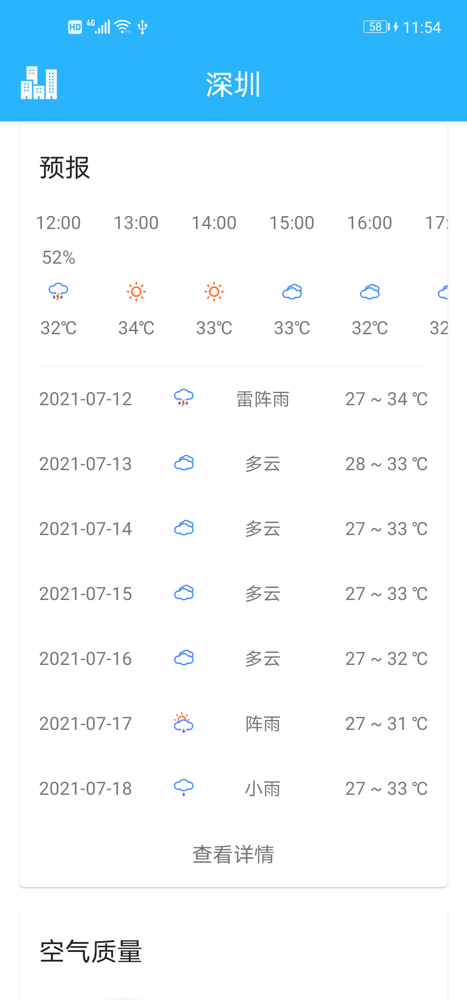

# XDWeather

练手天气APP

## 展示

主界面：  
  

逐小时和逐日天气预报：  
  

空气质量和生活指数：  
  

风力风向和太阳月亮：  
  

城市管理：  
  

逐日天气预报详情：  
  

天气灾害预警：  
  

城市搜索：  
  

## 说明

gradle.properties文件已被移除，请自行添加如下参数：

签名文件相关：

KEY_PATH=

KEY_PASS=

ALIAS_NAME=

ALIAS_PASS=

和风天气私钥（注：需要开发者账号私钥，个别接口普通用户账号不支持）：

PRIVATE_QWEATHER_KEY=
